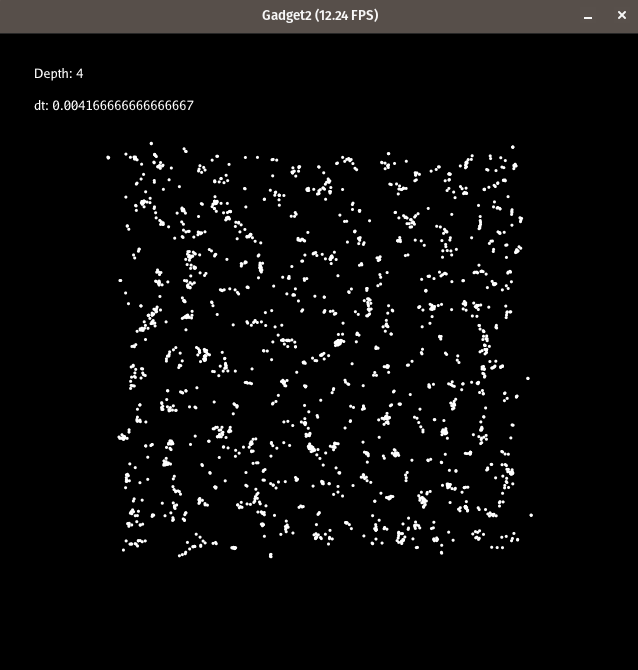

# Gadget-2 Inspired Cosmological Simulator

## Introduction

This project is a simplified implementation of [Gadget-2](https://arxiv.org/pdf/astro-ph/0505010), a highly efficient and accurate cosmological simulation code designed for large-scale structure formation in the universe. Gadget-2 is based on a combination of the Barnes-Hut tree algorithm for gravity and Smoothed Particle Hydrodynamics (SPH) for modeling fluids and gas dynamics.

The original Gadget-2 was used to carry out landmark simulations, including:

* The first cosmological N-body simulation with over $10^{10}$ dark matter particles.
* Large-scale SPH simulations incorporating radiative cooling and star formation with over 250 million particles.

> **Note:** This implementation is designed for educational and small-scale testing purposes. Some features have been simplified or omitted to run efficiently on personal machines instead of supercomputers.

---

## Usage

To run the simulation:

```bash
python3 main.py {square | circle} [--centralObject]
```

This command selects the initial particle configuration (square grid or circular distribution) and optionally adds a massive central object to influence the particles gravitationally.

You can modify the simulation settings via the `config.py` file.

---

## Modifiable Parameters

| Variable          | Meaning                                                                                                                                                                                             | Value                                                   |
| ----------------- | --------------------------------------------------------------------------------------------------------------------------------------------------------------------------------------------------- | ------------------------------------------------------- |
| particlesNb       | The number of particles in the simulation                                                                                                                                                           | 0 <= n                                                  |
| simdimx / simdimy | The simulated space dimensions                                                                                                                                                                      | Should not be inferior to margin if in square formation |
| resx / resy       | The size of the window                                                                                                                                                                              | 0 < n                                                   |
| fps               | Max frame per second                                                                                                                                                                                | By default 60.                                          |
| margin            | *square formation* - Determines the offset<br>from the border at which particles will spawn                                                                                                         | By default 100.                                         |
| radius            | *circle formation* - The radius of the circle<br>in which particles will spawn                                                                                                                      | By default 300.                                         |
| centerx, centery  | *circle formation* - The position of the center<br>of the circle                                                                                                                                    | By default equal to simdimx / 2, simdimy / 2.           |
| distribCoef       | *circle formation* - The coefficient of the<br>distribution of the particles' position from<br>the circle's center                                                                                  | By default 0.7                                          |
| centralObjectMass | *central Object* - The mass of the object at the<br>center of the simulation                                                                                                                        | By default 2000.0                                       |
| minMass, maxMass  | Respectively the lower and upper bounds of<br>particles' masses                                                                                                                                     | By default 10 and 100                                   |
| defaultdt         | The coefficient of change during integration                                                                                                                                                        | By default 1 / fps                                      |
| treshold          | The treshold used to determine if a cell of<br>the Barnes-Hut tree is far enough to be<br>approximated. The lower that variable is, the<br>more accurate the simulation is but the slower<br>it is. | By default 0.5                                          |
| G                 | The coefficient of gravity                                                                                                                                                                          | By default 1.0                                          |
| smoothingLength   | The smoothing coefficient of the SPH. Determines<br>how wide the smoothing kernel is.                                                                                                               | By default 0.2                                          |
| pressureConstant  | The constant value of the pressure in the<br>simulation                                                                                                                                             | By default 1.0                                          |

> Use the **left** and **right arrow keys** to slow down or accelerate the simulation. Be aware that increasing the speed may reduce accuracy due to larger time steps.

---

## Directory Structure

* `main.py`: Main simulation script and particle initialization pipeline.
* `quadtree.py`: Implementation of the Barnes-Hut tree structure and gravity traversal.
* `sph.py`: Implementation of SPH (Smoothed Particle Hydrodynamics) forces and density estimation.
* `integration.py`: Adaptive timestep control and particle integration (e.g., Euler or Leapfrog).
* `fields.py`: Declaration of Taichi field variables used for simulation state.
* `config.py`: Central file for user-defined configuration parameters.

---

## Algorithms

### 📦 Barnes-Hut Tree

To compute gravitational forces efficiently, this simulator uses a **Barnes-Hut quadtree** (2D variant) that clusters distant particles and approximates them using their **monopole moment** (mass and center of mass). This reduces the cost of computing all-pairs interactions from $\mathcal{O}(N^2)$ to approximately $\mathcal{O}(N \log N)$.

A threshold parameter $\theta$ (the `treshold` value in `config.py`) determines whether a node is considered "sufficiently far" to use its approximation.

### 🌊 Smoothed Particle Hydrodynamics (SPH)

The SPH method models gas behavior by estimating continuous fields (like density and pressure) using weighted sums over neighboring particles. The weight is determined by a **smoothing kernel** (e.g., cubic spline), which decays with distance.

Key steps:

* **Density estimation**:

  $$
  \rho_i = \sum_j m_j W(|\mathbf{r}_i - \mathbf{r}_j|, h)
  $$
* **Pressure force** (symmetrized form):

  $$
  \mathbf{f}_i^{\text{pressure}} = -\sum_j m_j \left( \frac{P_i}{\rho_i^2} + \frac{P_j}{\rho_j^2} \right) \nabla W(|\mathbf{r}_i - \mathbf{r}_j|, h)
  $$
* Pressure is computed using an **equation of state**, often:

  $$
  P_i = k \left( \frac{\rho_i}{\rho_0} - 1 \right)
  $$

### ⏱️ Adaptive Time-Stepping

The integration method uses **adaptive timesteps** that adjust based on simulation stability criteria. This ensures that particles evolve smoothly and that small structures are captured without globally slowing down the simulation.

Common criteria include:

* Density change rate
* Maximum particle velocity
* CFL-like conditions

---

## Results

The simulator can reproduce gravitational clustering, orbital motion, and SPH-based fluid effects in 2D. Below are screenshots of simulation results with different particle initializations:

* **Circular distribution** with and without a central massive object.
* **Square grid** showing structure collapse under self-gravity.
* **Varying SPH smoothing lengths**, highlighting effects on fluid-like pressure behavior.

<div style="display: flex; flex-direction: row; justify-content: left; align-items: center;">
<figure style="text-align: center; margin: 0 10px;">

<figcaption>1500 particles - Initial state</figcaption>
</figure>
<figure style="text-align: center; margin: 0 10px;">

<figcaption>1500 particles</figcaption>
</figure>
</div>

<div style="display: flex; flex-direction: row; justify-content: left; align-items: center;">
<figure style="text-align: center; margin: 0 10px;">

<figcaption>2000 particles - Initial state</figcaption>
</figure>
<figure style="text-align: center; margin: 0 10px;">

<figcaption>2000 particles</figcaption>
</figure>
</div>

<div style="display: flex; flex-direction: row; justify-content: left; align-items: center;">
<figure style="text-align: center; margin: 0 10px;">

<figcaption>10000 particles - Initial state</figcaption>
</figure>
<figure style="text-align: center; margin: 0 10px;">

<figcaption>10000 particles</figcaption>
</figure>
</div>

<div style="display: flex; flex-direction: row; justify-content: left; align-items: center;">
<figure style="text-align: center; margin: 0 10px;">

<figcaption>circle formation - Initial state</figcaption>
</figure>
<figure style="text-align: center; margin: 0 10px;">

<figcaption>circle formation</figcaption>
</figure>
</div>

<figure style="text-align: center; margin: 0 10px;">

<figcaption>Here would be the results with billions of particles</figcaption>
</figure>

---

## Future Work / Limitations

* Extend to 3D (octree-based Barnes-Hut).
* Add radiative cooling and star formation models.
* Improve parallelism for performance on larger particle counts.
* Handle SPH boundary conditions more realistically.
* Add visualization overlays for density and velocity fields.
